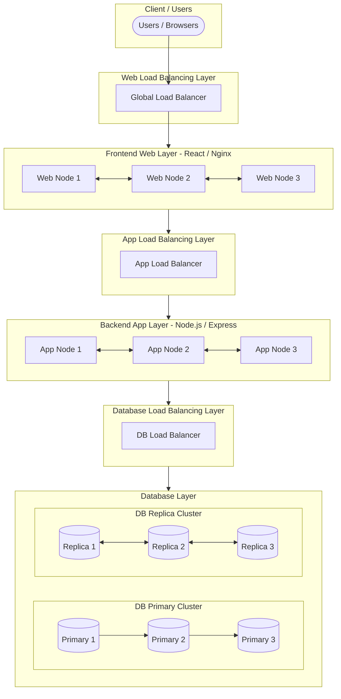

```mermaid
graph TD
    subgraph Client [Client / Users]
        User([Users / Browsers])
    end

    subgraph LB [Web Load Balancing Layer]
        direction LR
        ALB[Global Load Balancer]
    end

    subgraph WebLayer [Frontend Web Layer - React / Nginx]
        direction LR
        w1[Web Node 1] <--> w2[Web Node 2]
        w2 <--> w3[Web Node 3]
    end

    subgraph APLB [App Load Balancing Layer]
        direction LR
        aplb[App Load Balancer]
    end

    subgraph AppLayer [Backend App Layer - Node.js / Express]
        direction LR
        a1[App Node 1] <--> a2[App Node 2]
        a2 <--> a3[App Node 3]
    end

    subgraph DBLB [Database Load Balancing Layer]
        direction LR
        dblb[DB Load Balancer]
    end

    subgraph DatabaseLayer [Database Layer]
        subgraph PrimaryCluster [DB Primary Cluster]
            direction LR
            p1[(Primary 1)] --> p2[(Primary 2)]
            p2 --> p3[(Primary 3)]
        end

        subgraph ReplicaCluster [DB Replica Cluster]
            direction LR
            r1[(Replica 1)] <--> r2[(Replica 2)]
            r2 <--> r3[(Replica 3)]
        end
    end

    %% North-South Inter-layer Connections (Following the Layer -> LB -> Layer pattern)
    User --> ALB
    ALB --> WebLayer
    WebLayer --> APLB
    APLB --> AppLayer
    AppLayer --> DBLB
    DBLB --> DatabaseLayer
```

    %% East-West / Cross-Cluster Replication Traffic
    PrimaryCluster ==>|Replication Stream| ReplicaCluster
```
